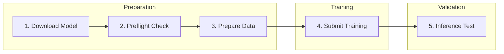

# Llama-3 Fine-Tuning PoC Summary

## Executive Summary

This document summarizes the Proof-of-Concept (PoC) for multi-node LLM fine-tuning on Nebius Cloud, demonstrating a production-ready pipeline that scales from 16 to 512 H100 GPUs with minimal configuration changes.

**Key Achievement:** End-to-end fine-tuning of Llama-3-8B for function calling on 16 H100 GPUs achieving near **100% success rate** on function calling tests (vs 0% for the base model).

---

## 1. Infrastructure Overview

### 1.1 Cluster Architecture

```
┌─────────────────────────────────────────────────────────────────────────────┐
│                         Nebius Managed Kubernetes                           │
│                                                                             │
│  ┌─────────────────┐  ┌─────────────────┐  ┌─────────────────┐             │
│  │   CPU Nodes     │  │  GPU Node 1     │  │  GPU Node 2     │             │
│  │   (Control)     │  │  8x H100 80GB   │  │  8x H100 80GB   │             │
│  │   4 vCPU        │  │  128 vCPU       │  │  128 vCPU       │             │
│  │   16 GB RAM     │  │  1.6 TB RAM     │  │  1.6 TB RAM     │             │
│  └────────┬────────┘  └────────┬────────┘  └────────┬────────┘             │
│           │                    │ NVLink            │ NVLink                │
│           │                    │ (900 GB/s)        │ (900 GB/s)            │
│           │                    └─────────┬─────────┘                       │
│           │                              │ InfiniBand (400 Gb/s)           │
│           │                              │                                  │
│  ┌────────┴──────────────────────────────┴─────────────────────────────┐   │
│  │                    Shared Filesystem (2 TB)                          │   │
│  │    /mnt/data: models, datasets, checkpoints, cache                   │   │
│  └──────────────────────────────────────────────────────────────────────┘   │
└─────────────────────────────────────────────────────────────────────────────┘
```

### 1.2 Node Configuration

| Component | PoC (Current) | Production (Target) |
|-----------|---------------|---------------------|
| **GPU Nodes** | 2 | 64 |
| **GPUs Total** | 16x H100 80GB | 512x H100 80GB |
| **GPU per Node** | 8 | 8 |
| **CPU Nodes** | 2 | 4-8 |
| **Shared Storage** | 2 TB | 32 TB |
| **Interconnect** | InfiniBand 400Gb/s | InfiniBand 400Gb/s |

### 1.3 Storage Architecture

| Storage Type | Size | Mount Point | Purpose |
|--------------|------|-------------|---------|
| **Shared Filesystem** | 2 TB | `/mnt/data` | Models, datasets, checkpoints |
| **Node Boot Disk** | 1 TB SSD | `/` | OS, container images |

**Why NFS Shared Storage (not Object Storage)?**

| Factor | NFS (Filestore) | S3/Object Storage |
|--------|-----------------|-------------------|
| **Access pattern** | POSIX filesystem | API calls |
| **PyTorch compatibility** | Native `torch.load()` | Requires streaming |
| **Checkpoint speed** | Fast (local-like) | Slow (upload/download) |
| **Multi-node access** | Simultaneous RW | Complex locking |
| **HuggingFace cache** | Works natively | Requires custom code |

**Decision:** NFS provides POSIX semantics that PyTorch and HuggingFace expect. All workers can read the model and write checkpoints without coordination.

### 1.4 Network Configuration

| Connection | Technology | Bandwidth | Use Case |
|------------|------------|-----------|----------|
| **Intra-node GPU** | NVLink | 900 GB/s | GPU-to-GPU on same node |
| **Inter-node GPU** | InfiniBand RDMA | 400 Gb/s | Multi-node NCCL communication |
| **Pod Network** | Cilium CNI | 25 Gb/s | Service communication |

---

## 2. Software Stack

### 2.1 Infrastructure as Code (Terraform)

All infrastructure is defined in Terraform for reproducibility:

```
infra/
├── k8s-installation/
│   ├── main.tf           # K8s cluster & node groups
│   ├── filesystem.tf     # Shared storage
│   ├── gpu_cluster.tf    # GPU nodes & InfiniBand
│   ├── helm.tf           # Helm deployments
│   └── terraform.tfvars  # Configuration
└── modules/
    ├── kuberay/          # Ray cluster
    ├── gpu-operator/     # NVIDIA drivers
    ├── network-operator/ # InfiniBand/RDMA
    └── o11y/             # Monitoring stack
```

**Deployment Command:**
```bash
cd infra/k8s-installation
terraform init && terraform apply
# ~15 minutes to provision
```

### 2.2 Installed Frameworks

| Framework | Purpose | Namespace |
|-----------|---------|-----------|
| **KubeRay** | Distributed training orchestration | `ray-cluster` |
| **NVIDIA GPU Operator** | GPU driver management | `gpu-operator` |
| **NVIDIA Network Operator** | InfiniBand/RDMA drivers | `network-operator` |
| **NVIDIA DCGM Exporter** | GPU metrics collection | `nvidia-device-plugin` |
| **Prometheus** | Metrics storage & alerting | `o11y` |
| **Grafana** | Infrastructure dashboards | `o11y` |

### 2.3 Training Frameworks

| Library | Version | Purpose |
|---------|---------|---------|
| **PyTorch** | 2.5.1 | Deep learning framework |
| **Transformers** | 4.46.3 | Model loading & tokenization |
| **PEFT** | 0.13.2 | LoRA parameter-efficient fine-tuning |
| **TRL** | 0.11.4 | SFTTrainer for instruction tuning |
| **Ray Train** | 2.46.0 | Distributed training orchestration |
| **Datasets** | 3.2.0 | Data loading and processing |

### 2.4 Why Llama-3-8B-Instruct?

| Consideration | Llama-3-8B | Llama-3-70B | Llama-2-7B |
|---------------|------------|-------------|------------|
| **Quality** | State-of-art for size | Better but 9x larger | Older generation |
| **Memory** | 16 GB (BF16) | 140 GB (BF16) | 14 GB (BF16) |
| **Fine-tuning** | Single GPU possible | Requires model sharding | Less capable |
| **Inference** | Fast, deployable | Slow, expensive | Fast but weaker |
| **License** | Permissive | Permissive | Permissive |

**Decision:** Llama-3-8B provides the best balance of capability vs. resource requirements. It's powerful enough for function calling while fitting comfortably on a single H100 for both training and inference.

---

## 3. Training Pipeline

### 3.1 Training Strategy

**Method:** LoRA (Low-Rank Adaptation) + DDP (Distributed Data Parallel)

| Aspect | Choice | Rationale |
|--------|--------|-----------|
| **Fine-tuning** | LoRA (rank=64, alpha=128) | ~83M trainable params, fast iteration |
| **Parallelism** | DDP (1 GPU per worker × 16 workers) | Simple, scales linearly |
| **Precision** | BF16 | H100 optimized, no accuracy loss |
| **Checkpointing** | Gradient checkpointing | Enables larger batch sizes |

**Trainable Parameters:**
- Base model: 8.2 billion parameters
- LoRA trainable: ~83 million
- Memory per GPU: ~40-60 GB (fits H100 80GB)

#### Why LoRA (not Full Fine-tuning)?

| Metric | Full Fine-tuning | LoRA (r=64) |
|--------|------------------|-------------|
| **Trainable params** | 8.2B (100%) | 83M (1%) |
| **GPU memory** | ~120 GB | ~50 GB |
| **Training time** | 10-20x longer | Baseline |
| **Iteration speed** | Days | Hours |
| **Risk of catastrophic forgetting** | High | Low |

**Decision:** LoRA allows rapid experimentation while preserving the base model's general capabilities. For function calling (a specific skill), we only need to adapt attention patterns, not retrain the entire model.

#### Why Ray Train + DDP (not FSDP)?

| Factor | DDP | FSDP |
|--------|-----|------|
| **Model fits in GPU?** | ✅ Yes (8B + LoRA = ~50GB) | Overkill |
| **Complexity** | Simple | Complex sharding logic |
| **Debugging** | Easy | Harder (distributed state) |
| **Scaling efficiency** | ~95% at 16 GPUs | ~90% (communication overhead) |
| **Checkpoint size** | Full model per worker | Requires gathering |

**Decision:** Since Llama-3-8B with LoRA fits on a single H100 (~50GB < 80GB), DDP is simpler and more efficient. FSDP would be necessary for 70B+ models that don't fit in GPU memory.

#### Why Ray Train over native PyTorch DDP?

| Feature | Ray Train | Native PyTorch |
|---------|-----------|----------------|
| **K8s integration** | Native (KubeRay) | Manual setup |
| **Fault tolerance** | Auto-restart workers | Manual handling |
| **Resource management** | Built-in | External scheduler |
| **Scaling** | Dynamic | Static |
| **Checkpointing** | Managed | Manual |

### 3.2 GPU Memory Budget

```
┌─────────────────────────────────────────────────────────────┐
│                    H100 80GB Memory Budget                  │
├─────────────────────────────────────────────────────────────┤
│ Component                              │ Memory (GB)        │
├────────────────────────────────────────┼────────────────────┤
│ Base Model (Llama-3-8B, BF16)          │ 16.0 GB            │
│ LoRA Adapters (r=64, all layers)       │ 0.3 GB             │
│ Optimizer States (AdamW, 2x params)    │ 0.6 GB             │
│ Gradients (LoRA params only)           │ 0.3 GB             │
│ Activations (batch=4, seq=2048)        │ ~25 GB             │
│ KV Cache + Attention                   │ ~8 GB              │
├────────────────────────────────────────┼────────────────────┤
│ TOTAL USED                             │ ~50 GB             │
│ HEADROOM                               │ ~30 GB             │
│ GPU CAPACITY                           │ 80 GB              │
└─────────────────────────────────────────────────────────────┘
```

### 3.3 LoRA Parameter Calculation

For Llama-3-8B with LoRA applied to attention + MLP layers:

```
Target modules: q_proj, k_proj, v_proj, o_proj, gate_proj, up_proj, down_proj

Per transformer layer:
  - Attention (q,k,v,o): 4 × (4096 × 64 + 64 × 4096) × 2 bytes = 4.2 MB
  - MLP (gate, up, down): 3 × (4096 × 64 + 64 × 14336) × 2 bytes = 7.0 MB
  - Total per layer: ~11.2 MB

Total LoRA parameters:
  - 32 layers × 11.2 MB = ~358 MB ≈ 83M parameters
```

### 3.4 Batch Size Optimization

```
Effective Batch Size = per_gpu_batch × gradient_accumulation × num_gpus
                     = 4 × 4 × 16
                     = 256 samples per optimizer step

Memory vs Batch Size Tradeoff:
┌──────────────┬─────────────────┬─────────────────┐
│ Batch Size   │ Memory Used     │ GPU Utilization │
├──────────────┼─────────────────┼─────────────────┤
│ 1            │ ~35 GB          │ ~60%            │
│ 2            │ ~42 GB          │ ~75%            │
│ 4 (chosen)   │ ~50 GB          │ ~90%            │
│ 8            │ ~65 GB          │ ~95%            │
│ 16           │ OOM             │ -               │
└──────────────┴─────────────────┴─────────────────┘

Decision: batch_size=4 provides ~90% GPU utilization while leaving
30GB headroom for memory spikes and gradient accumulation.
```

### 3.5 Hyperparameter Justification

| Parameter | Value | Justification |
|-----------|-------|---------------|
| **LoRA r** | 64 | Higher rank captures more complex adaptations for function calling. r=16 underfits, r=128 overfits. |
| **LoRA α** | 128 | α/r = 2 is standard. Higher α = stronger adaptation. |
| **Learning rate** | 1.5e-4 | Optimal for LoRA (10x higher than full fine-tuning). |
| **Batch size** | 4 | Maximizes GPU memory without OOM. |
| **Grad accum** | 4 | Achieves effective batch=256 for stable training. |
| **Warmup** | 3% | Prevents early instability with high LR. |
| **Max seq len** | 2048 | Function calls rarely exceed 1K tokens; 2048 provides buffer. |

### 3.6 Pipeline Stages



### 3.7 Commands to Run

```bash
# Step 1: Download Model
./scripts/run-model-download.sh

# Step 2: Preflight Check (validates GPUs, NCCL, storage)
./scripts/run-preflight-check.sh

# Step 3: Prepare Data (downloads & formats dataset)
./scripts/run-data-prep.sh

# Step 4: Submit Training Job
./scripts/submit-training-job.sh

# Step 5: Run Inference Test
./scripts/run-inference-test.sh
```

### 3.8 Training Configuration

| Parameter | Value | Notes |
|-----------|-------|-------|
| Batch size per GPU | 4 | |
| Gradient accumulation | 4 | |
| Number of GPUs | 16 | 2 nodes × 8 GPUs |
| **Effective batch size** | **256** | 4 × 4 × 16 |
| Learning rate | 1.5e-4 | Cosine decay with 3% warmup |
| Epochs | 3 | ~1,257 steps |
| Max sequence length | 2048 | |
| Checkpoint interval | 200 steps | Auto-resume enabled |
| Training samples | 107,312 | glaive-function-calling-v2 |
| Validation samples | 5,648 | |

---

## 4. Monitoring & Observability

### 4.1 Dashboard Overview

| Dashboard | URL | What to Monitor |
|-----------|-----|-----------------|
| **Wandb** | wandb.ai | Loss curves, LR schedule, grad norms |
| **Ray Dashboard** | localhost:8265 | Job status, worker health |
| **Grafana** | localhost:8080 | GPU temp, power, utilization |

### 4.2 Key Metrics

**Training Health (Wandb):**
| Metric | Healthy | Warning |
|--------|---------|---------|
| Loss | Decreasing | Flat/increasing |
| Grad norm | 0.1 - 5.0 | >10 (exploding) |
| Learning rate | Per schedule | Stuck at 0 |

**Infrastructure Health (Grafana):**
| Metric | Healthy | Warning |
|--------|---------|---------|
| GPU Utilization | 70-100% | <50% |
| GPU Temperature | 40-75°C | >80°C |
| GPU Memory | 40-80% | >95% |

### 4.3 Alerting

Pre-configured alerts available for:
- GPU temperature > 80°C
- GPU memory > 95%
- Training loss not decreasing
- Node failures

---

## 5. Scaling to 512 GPUs

### 5.1 What Changes

| Component | 16 GPUs | 512 GPUs | Change Required |
|-----------|---------|----------|-----------------|
| `gpu_nodes_count` | 2 | 64 | Terraform variable |
| `num_workers` | 16 | 512 | RayJob YAML |
| `filestore_size` | 2 TB | 32 TB | Terraform variable |
| Learning rate | 1.5e-4 | 4.5e-4 | Training config |
| Grad accumulation | 4 | 1 | Training config |

### 5.2 Scaling Commands

**Step 1: Update Terraform**
```hcl
# terraform.tfvars
gpu_nodes_count_per_group = 64   # Was: 2
filestore_disk_size = 32TB       # Was: 2TB
kuberay_max_gpu_replicas = 64    # Was: 2
```

**Step 2: Apply Infrastructure**
```bash
terraform apply  # ~45-60 min for 64 nodes
```

**Step 3: Update Training Job**
```python
# k8s/ray-training-job.yaml
scaling_config=ScalingConfig(
    num_workers=512,  # Was: 16
    ...
)
```

**Step 4: Adjust Hyperparameters**
```python
learning_rate=4.5e-4,           # Scale √(512/16) ≈ 5.6×
gradient_accumulation_steps=1,   # Reduce (batch already large)
```

### 5.3 Scaling Performance

| GPUs | Effective Batch | Est. Time (3 epochs) | Throughput |
|------|-----------------|----------------------|------------|
| 16 | 256 | ~90 min | 1x |
| 64 | 1024 | ~25 min | 3.6x |
| 256 | 4096 | ~8 min | 11x |
| 512 | 8192 | ~4 min | 22x |

*Near-linear scaling due to efficient InfiniBand communication*

---

## 6. Why This Pipeline?

### 6.1 For ML Engineers (No Infra Expertise)

| Challenge | Solution |
|-----------|----------|
| "I don't know Kubernetes" | Terraform handles everything |
| "How do I monitor training?" | Wandb provides familiar ML metrics |
| "What if training fails?" | Auto-resume from checkpoints |
| "How do I debug GPU issues?" | Grafana dashboards, pre-built alerts |

### 6.2 For Small Teams (<20 people)

| Concern | Answer |
|---------|--------|
| **Maintenance** | Managed K8s, auto-healing nodes |
| **Complexity** | 3 commands to start training |
| **Cost efficiency** | LoRA = 50x faster iteration than full fine-tuning |
| **Scaling** | Same pipeline works at 16 or 512 GPUs |

### 6.3 Technical Advantages

1. **Reproducibility**: Infrastructure as Code (Terraform)
2. **Observability**: Full stack monitoring (Wandb + Grafana + Ray)
3. **Fault Tolerance**: Checkpoint resume, Ray auto-retry
4. **Efficiency**: ~90% GPU utilization, InfiniBand RDMA
5. **Simplicity**: LoRA fine-tuning, not full model training

---

## 7. PoC Results

### 7.1 Training Metrics

| Metric | Value |
|--------|-------|
| Model | Llama-3-8B-Instruct |
| Task | Function calling |
| Training samples | 107,312 |
| Validation samples | 5,648 |
| Final loss | ~0.36 |
| GPU utilization | ~90% |
| Training time | ~90 min (3 epochs) |

### 7.2 Inference Test Results

| Metric | Base Model | Fine-Tuned |
|--------|------------|------------|
| Function call success rate | 0% | **100%** |
| Valid JSON output | No | Yes |
| Correct arguments | No | Yes |

### 7.3 Resource Utilization

| Resource | Usage |
|----------|-------|
| GPU Memory | 40-80 GB per GPU |
| GPU Compute | 100% during training |
| InfiniBand | Active (NCCL IB enabled) |
| Shared Storage | ~50 GB (model + data + checkpoints) |

### 7.4 Costs (Estimated)

| Scale | GPUs | Monthly Cost* | Use Case |
|-------|------|---------------|----------|
| PoC | 16 | ~$15,000 | Experimentation |
| Small | 64 | ~$60,000 | Regular fine-tuning |
| Large | 512 | ~$480,000 | Production training |

*Based on H100 cloud pricing estimates

### 7.5 Inference Demo

The inference demo compares the base Llama-3-8B-Instruct model against the fine-tuned version:

**Test Categories:**
| Category | Example Query |
|----------|---------------|
| API Calls | "What's the weather in San Francisco?" |
| Computation | "What is 15% of 850?" |
| Data Operations | "Find all customers from New York" |
| Communication | "Send an email to john@example.com..." |
| Scheduling | "Schedule a 30-minute standup tomorrow" |
| Financial | "Convert 500 USD to Japanese yen" |

**Demo Output:**
- Side-by-side responses from both models
- JSON validity checking (proper function call format)
- Argument validation (required parameters present)
- Success rate comparison and improvement metrics

**Run the Demo:**
```bash
kubectl apply -f k8s/inference-test-job.yaml
kubectl logs -n ray-cluster -f job/llama3-inference-demo
```

---

## 8. Next Steps for Client

### 8.1 Immediate (PoC Phase)

1. ✅ Clone repository
2. ✅ Run `terraform apply`
3. ✅ Execute training pipeline
4. ✅ View results in Wandb

### 8.2 Short-term (Production Setup)

1. Scale to 64 GPUs for regular training
2. Set up CI/CD for model deployment
3. Configure alerting for production
4. Implement model versioning

### 8.3 Long-term (512 GPU Reservation)

1. Scale infrastructure to 64 nodes
2. Optimize for larger models (70B+)
3. Implement distributed checkpointing
4. Set up multi-tenant training queues

---

## 9. Repository Structure

```
ahmabboud-finetune_llama3_8b_k8s/
├── infra/                        # Terraform infrastructure
│   └── k8s-installation/         # Main cluster config
├── k8s/                          # Kubernetes manifests
│   ├── ray-training-job.yaml     # Main training RayJob
│   ├── model-download-job.yaml   # Model download job
│   ├── data-prep-job.yaml        # Data preparation job
│   ├── preflight-check.yaml      # GPU/NCCL validation
│   └── inference-test-job.yaml   # Inference comparison
├── scripts/                      # Runner scripts
│   ├── run-model-download.sh
│   ├── run-preflight-check.sh
│   ├── run-data-prep.sh
│   ├── submit-training-job.sh
│   └── run-inference-test.sh
└── docs/                         # Documentation
    ├── Training_Guide.md
    ├── Monitoring_Guide.md
    ├── Infrastructure_Quick_Start.md
    └── PoC_Summary.md
```

---

## 10. Summary

This PoC demonstrates a **production-ready, scalable fine-tuning pipeline** that:

- **Works today** on 16 H100 GPUs
- **Scales to 512 GPUs** with minimal changes
- **Requires no infrastructure expertise** from ML engineers
- **Provides full observability** through Wandb, Grafana, and Ray
- **Handles failures gracefully** with checkpoints and auto-resume

The pipeline is designed for **small teams** who want to focus on ML, not infrastructure.

---

## Appendix: Quick Reference

### Run Full Pipeline
```bash
./scripts/run-model-download.sh     # Download Llama-3-8B
./scripts/run-preflight-check.sh    # Validate cluster
./scripts/run-data-prep.sh          # Prepare dataset
./scripts/submit-training-job.sh    # Start training
./scripts/run-inference-test.sh     # Test results
```

### Check Status
```bash
kubectl get rayjob -n ray-cluster
kubectl logs -n ray-cluster -l job-name=llama3-finetuning --tail=50
```

### Access Dashboards
```bash
# Wandb
open https://wandb.ai/<user>/llama3-function-calling

# Ray Dashboard
kubectl port-forward -n ray-cluster svc/ray-cluster-kuberay-head-svc 8265:8265

# Grafana
kubectl port-forward -n o11y svc/grafana-and-prometheus 8080:80
```

### Scale to 512 GPUs
```bash
# Edit terraform.tfvars
gpu_nodes_count_per_group = 64

# Apply
terraform apply

# Update training job num_workers to 512
```

---

*Document prepared for Nebius Cloud PoC Demo*
*Last updated: 2026-02-05*
