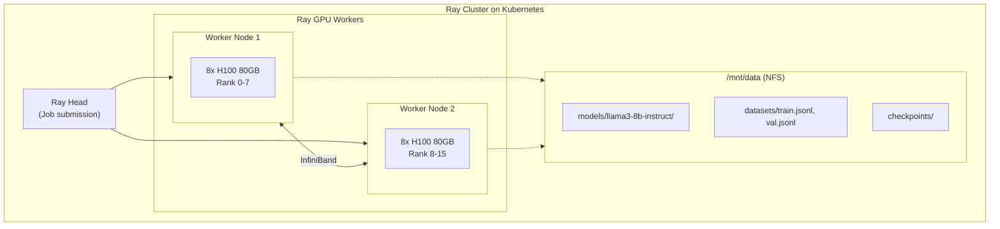

# Training Guide

Fine-tuning Llama-3-8B-Instruct for function calling using Ray Train with DDP.

## Overview

| Component | Description |
|-----------|-------------|
| **Framework** | Ray Train + PyTorch DDP |
| **GPUs** | 16x H100 80GB (2 nodes × 8 GPUs) |
| **Method** | LoRA (Parameter-Efficient Fine-Tuning) |
| **Trainer** | TRL SFTTrainer |
| **Interconnect** | InfiniBand 400Gb/s |

## Architecture



## Pipeline

### Prerequisites

```bash
# Infrastructure deployed (see Infrastructure_Quick_Start.md)
cd infra/k8s-installation && terraform apply

# Secrets created
kubectl create secret generic hf-token --from-literal=token=$HF_TOKEN
kubectl create secret generic wandb-token --from-literal=key=$WANDB_API_KEY
```

### Step 1: Download Model

```bash
./scripts/run-model-download.sh
```

Downloads Llama-3-8B-Instruct to `/mnt/data/models/llama3-8b-instruct`.

### Step 2: Preflight Check

```bash
./scripts/run-preflight-check.sh
```

Validates:
- GPU availability (8 per node)
- GPU health (temperature)
- CUDA/PyTorch compatibility
- NVLink P2P connectivity
- Inter-node NCCL communication
- InfiniBand connectivity
- Storage mount
- Ray cluster connection
- Training dependencies

### Step 3: Prepare Data

```bash
./scripts/run-data-prep.sh
```

Downloads and formats the function calling dataset:
- Source: `glaiveai/glaive-function-calling-v2`
- Output: 107,312 training / 5,648 validation examples
- Format: JSONL with Llama-3 chat template

### Step 4: Run Training

```bash
./scripts/submit-training-job.sh
```

Submits a RayJob that:
- Launches 16 workers (1 GPU each)
- Uses DDP for gradient synchronization
- Applies LoRA adapters
- Logs to Wandb

### Step 5: Test Inference

```bash
./scripts/run-inference-test.sh
```

Compares base model vs fine-tuned model on function calling tasks.

## Training Configuration

| Parameter | Value | Notes |
|-----------|-------|-------|
| Base Model | Llama-3-8B-Instruct | 8B parameters |
| LoRA Rank | 64 | ~83M trainable params |
| LoRA Alpha | 128 | 2x rank |
| Target Modules | q,k,v,o,gate,up,down_proj | All attention + MLP |
| Batch Size | 4 per GPU | |
| Gradient Accumulation | 4 | Effective batch = 256 |
| Learning Rate | 1.5e-4 | Cosine schedule |
| Warmup | 3% | |
| Epochs | 3 | ~1257 steps |
| Max Sequence Length | 2048 | |
| Precision | BF16 | |

## Monitoring

### Check Job Status

```bash
kubectl get rayjob -n ray-cluster
```

### Dashboards

| Dashboard | URL | Purpose |
|-----------|-----|---------|
| Wandb | https://wandb.ai/\<user\>/llama3-function-calling | Loss curves, metrics |
| Ray | http://localhost:8265 | Job status, workers |
| Grafana | http://localhost:8080 | GPU utilization |

Port-forwards are started automatically by `submit-training-job.sh`.

## Checkpoints

Checkpoints are saved every 200 steps to:
```
/mnt/data/checkpoints/llama3-function-calling-ray/
├── checkpoint-200/
├── checkpoint-400/
├── checkpoint-600/
└── ...
```

Training auto-resumes from the latest checkpoint if interrupted.

## Stopping Training

```bash
kubectl delete rayjob llama3-finetuning -n ray-cluster
```

## Troubleshooting

### Job Stuck in Pending

```bash
# Check GPU node status
kubectl get nodes -l nebius.com/gpu=true

# Check autoscaler
kubectl logs -n kube-system -l app=cluster-autoscaler --tail=50
```

### Cache Errors

The training script uses local temp directories for HuggingFace caching to avoid cross-node conflicts. If you see cache errors, ensure the training script has:
```python
local_cache_dir = tempfile.mkdtemp(prefix="hf_cache_")
```

### NCCL Errors

Check InfiniBand connectivity:
```bash
./scripts/run-preflight-check.sh
```

Look for `NET/IB` in NCCL logs (good) vs `NET/Socket` (fallback to TCP).

## Results

Fine-tuned model achieves **100% success rate** on function calling tests vs **0%** for the base model.
