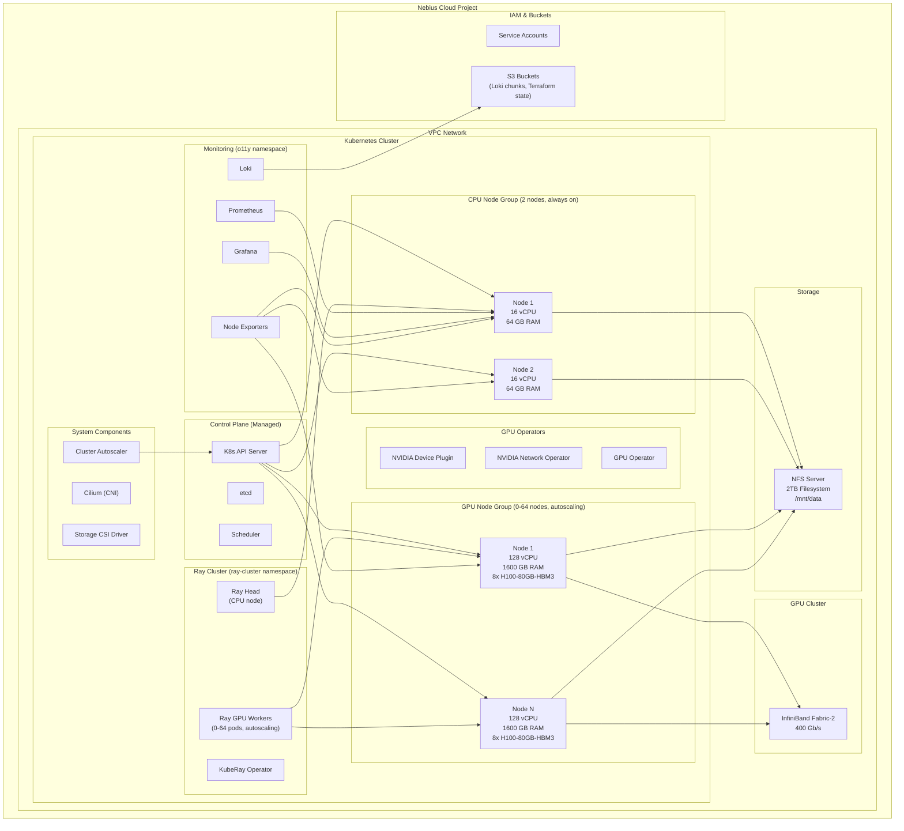
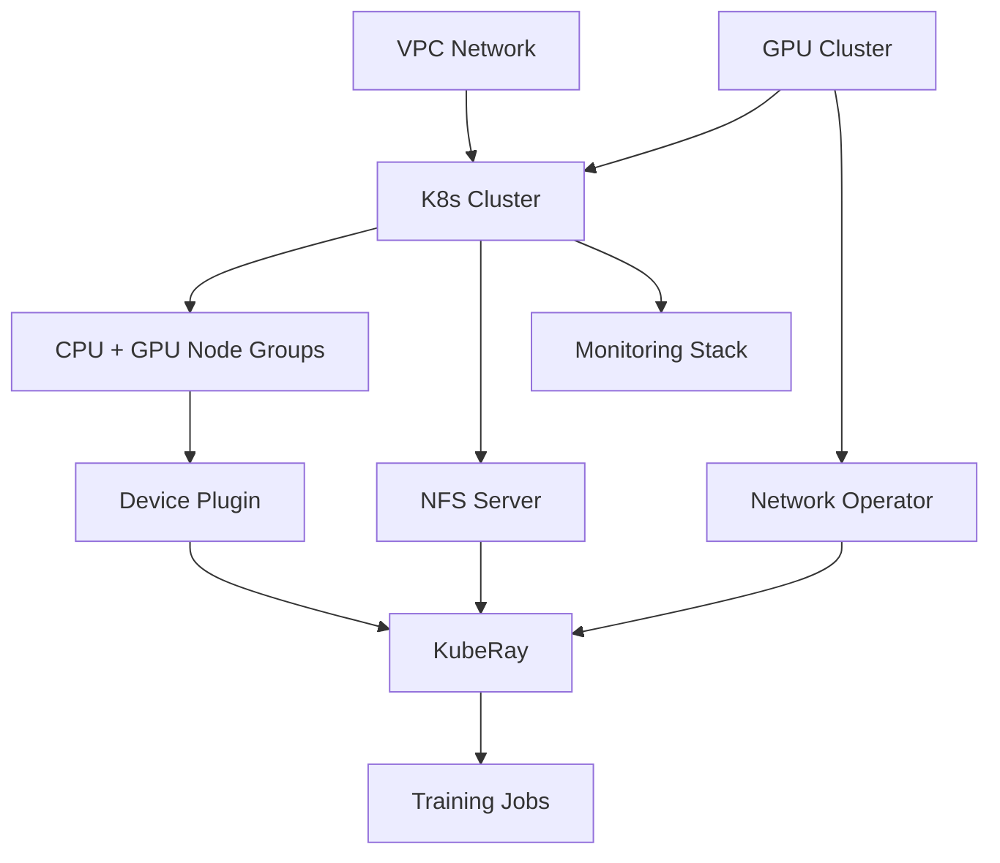

# Infrastructure - Complete Explanation

## Overview

This infrastructure deploys a **production-grade Kubernetes cluster on Nebius Cloud** optimized for distributed GPU training of Large Language Models (LLMs).

```
Goal: Run distributed ML training on 16-512 H100 GPUs with auto-scaling
Platform: Nebius Cloud (European cloud provider)
IaC: Terraform + Helm
Compute: Kubernetes with CPU + GPU node groups
Network: InfiniBand fabric-2 (400 Gb/s) for GPU interconnect
Storage: 2TB NFS shared filesystem
Monitoring: Prometheus + Grafana + Loki
```

---

## Quick Reference - Key Files

### Where to Make Common Changes

| What to Change | File to Edit | Line(s) |
|----------------|--------------|---------|
| **GPU node count** (scale to 64) | `terraform.tfvars` | 12 (`gpu_max_nodes`) |
| **InfiniBand fabric** (change fabric-2→3) | `terraform.tfvars` | 21 (`infiniband_fabric`) |
| **Ray GPU workers** (increase to 512) | `terraform.tfvars` | 49 (`kuberay_max_gpu_replicas`) |
| **NFS size** (increase from 2TB) | `terraform.tfvars` | 34 (`filestore_disk_size`) |
| **CPU node count** | `terraform.tfvars` | 7 (`cpu_nodes_count`) |
| **Enable/disable monitoring** | `terraform.tfvars` | 30-31 (`enable_prometheus`, `enable_loki`) |
| **Project credentials** | `environment.sh` | 1-3 (tenant/project IDs) |
| **GPU node taints** | `variables.tf` | (look for `gpu_node_taints`) |

### File Structure Overview

```
infra/k8s-installation/
├── 📝 terraform.tfvars         ⭐ EDIT THIS! Your configuration values
├── 🔐 environment.sh           ⭐ Your credentials (tenant/project IDs)
│
├── main.tf                     K8s cluster + CPU & GPU node groups
├── gpu_cluster.tf              InfiniBand GPU cluster
├── filesystem.tf               NFS shared storage
├── applications.tf             KubeRay Helm deployment
├── helm.tf                     NVIDIA operators & monitoring
│
├── variables.tf                Variable definitions (rarely modified)
├── locals.tf                   Computed values (automatic)
├── provider.tf                 Nebius provider config
└── output.tf                   Exported values (NFS IP, cluster endpoint)
```

### Workflow for Making Changes

```bash
# 1. Edit configuration
vim infra/k8s-installation/terraform.tfvars

# 2. Review changes
cd infra/k8s-installation
terraform plan

# 3. Apply if correct
terraform apply

# 4. Verify in K8s
export KUBECONFIG=~/.kube/config-k8s-training
kubectl get nodes
kubectl get pods -A
```

---

## Architecture Diagram



---

## File Structure - Where Configurations Live

```
infra/k8s-installation/
├── main.tf                    # K8s cluster + node groups
├── gpu_cluster.tf             # InfiniBand GPU cluster
├── filesystem.tf              # NFS shared filesystem
├── applications.tf            # Helm charts (KubeRay, etc.)
├── helm.tf                    # GPU & network operators
├── terraform.tfvars           # ⭐ YOUR VALUES (edit this!)
├── variables.tf               # Variable definitions
├── locals.tf                  # Computed values
├── provider.tf                # Nebius provider config
├── environment.sh             # Credentials & project IDs
└── output.tf                  # Exported values
```

**Key files you'll modify:**
- **`terraform.tfvars`** - All your settings (GPU count, node size, etc.)
- **`environment.sh`** - Project ID, tenant ID, region
- **`variables.tf`** - Only if adding new options

---

## Infrastructure Components

### 1. Nebius Platform Fundamentals

#### **Organization Structure**

```
Nebius Account
  └─ Tenant (tenant-e00ge0k85q6g1yzq44)
      └─ Project (project-e00tqj9wpr00542mztjr7q)
          └─ Resources (K8s cluster, VPC, GPU cluster, etc.)
```

**Key concepts:**
- **Tenant**: Top-level billing and organization boundary
- **Project**: Logical grouping of resources (like AWS Account or GCP Project)
- **Resources**: Actual infrastructure (clusters, networks, storage)

**Terraform mapping:**
```hcl
# File: infra/k8s-installation/provider.tf
provider "nebius" {
  tenant_id  = var.tenant_id      # From environment.sh
  project_id = var.project_id     # From environment.sh
  region     = "eu-north1"         # Data center location
}
```

**Where values come from:**
```bash
# File: infra/k8s-installation/environment.sh
export NEBIUS_TENANT_ID="tenant-e00ge0k85q6g1yzq44"
export NEBIUS_PROJECT_ID="project-e00tqj9wpr00542mztjr7q"
export NEBIUS_REGION="eu-north1"
```

---

#### **IAM (Identity & Access Management)**

**Service Accounts:**

```hcl
# File: infra/k8s-installation/main.tf (lines 30-45)

# K8s node group service account
resource "nebius_iam_v1_service_account" "k8s_node_group_sa" {
  parent_id = var.project_id
  name      = "k8s_node_group_sa-${random_string.random.result}"
}

# Added to 'editors' group for full access
resource "nebius_iam_v1_group_membership" "k8s_node_group_sa-admin" {
  group_id = data.nebius_iam_v1_group.editors.id
  member   = "serviceAccount:${nebius_iam_v1_service_account.k8s_node_group_sa.id}"
}
```

**Controlled by:**
```hcl
# File: infra/k8s-installation/terraform.tfvars (line 32)
enable_k8s_node_group_sa = true  # Set to false to disable
```

**Why service accounts?**
- Nodes need permissions to:
  - Pull container images from Nebius registry
  - Access NFS filesystem
  - Register with cluster autoscaler
  - Write metrics to monitoring
  
**Security model:**
- Service accounts use IAM tokens (not SSH keys)
- Automatic rotation every 12 hours
- Scoped to specific project only
- Can be audited via IAM logs

---


### 2. Kubernetes Cluster Architecture

#### **Managed Control Plane**

```hcl
# File: infra/k8s-installation/main.tf (lines 1-12)

resource "nebius_mk8s_v1_cluster" "k8s-cluster" {
  parent_id = var.project_id
  name      = "k8s-training-${random_string.random.result}"
  
  control_plane = {
    endpoints = {
      public_endpoint = {}  # Accessible from internet
    }
    etcd_cluster_size = var.etcd_cluster_size
    subnet_id         = var.subnet_id
    version           = var.k8s_version
  }
}
```

**Configuration values:**
```hcl
# File: infra/k8s-installation/terraform.tfvars (not shown, uses defaults)
# k8s_version = "1.32"       # Latest stable
# etcd_cluster_size = 3      # Default (HA setup)
```

**What Nebius manages:**
- K8s API server (HA with 3 replicas)
- etcd cluster (persistent state)
- kube-scheduler
- kube-controller-manager
- Cloud controller manager (Nebius integration)

**What you manage:**
- Worker nodes (CPU & GPU)
- Applications and workloads
- Monitoring stack
- Storage

**Benefits:**
- ✅ Automatic K8s upgrades
- ✅ HA control plane (99.9% SLA)
- ✅ Automatic etcd backups
- ✅ No control plane costs (only worker nodes)

---

#### **VPC Networking**

```hcl
# Referenced from variables (pre-created)
vpc_id        = "vpc-xxx"
vpc_subnet_id = "vpcsubnet-e00fqq27c2k5p5dp73"
```

**Network architecture:**

```
VPC CIDR: 10.0.0.0/16
  └─ Subnet: 10.4.0.0/16 (for K8s nodes)
  
Pod CIDR: 10.244.0.0/16 (Cilium manages)
Service CIDR: 10.96.0.0/12 (K8s default)
```

**IP allocation example:**

```
CPU Node 1:   10.4.0.1
CPU Node 2:   10.4.0.2
GPU Node 1:   10.4.63.5
GPU Node 2:   10.4.63.125

Ray Head Pod:       10.244.0.15
Ray Worker Pod 1:   10.244.1.23
Grafana Pod:        10.244.2.8
```

**Cilium CNI:**
- Layer 4 load balancing
- Network policies (firewalling between pods)
- eBPF-based (high performance)
- Egress gateway support (for whitelisting)

**Communication paths:**

```
Pod → Pod (same node):     localhost (no network)
Pod → Pod (diff node):     Cilium overlay (VXLAN)
GPU → GPU (same node):     NVLink (900 GB/s)
GPU → GPU (diff node):     InfiniBand (400 Gb/s)
```

---

### 3. CPU Node Group (Always-On)

#### **Configuration**

```hcl
# File: infra/k8s-installation/main.tf (lines 48-99)

resource "nebius_mk8s_v1_node_group" "cpu-only" {
  count = var.cpu_node_groups
  
  name       = "cpu-only-${random_string.random.result}"
  cluster_id = nebius_mk8s_v1_cluster.k8s-cluster.id
  
  node_template = {
    boot_disk = {
      size_bytes = local.cpu_nodes_disk_size  # 100 GB
    }
    
    cloud_init_user_data = templatefile(
      "${path.module}/../modules/cloud-init/k8s-cloud-init.tftpl",
      { ssh_public_key = file(var.ssh_public_key_path), ... }
    )
    
    name      = "cpu-only"
    platform  = local.cpu_nodes_platform      # "cpu-e2"
    preset_id = local.cpu_nodes_preset        # "16vcpu-64gb"
    
    resources = {
      resource_preset_id = local.cpu_nodes_preset
    }
  }
  
  scale_policy = {
    fixed_scale = {
      size = var.cpu_nodes_count  # Always 2 nodes
    }
  }
}
```

**Configuration values:**
```hcl
# File: infra/k8s-installation/terraform.tfvars (line 7)
cpu_nodes_count = 2

# File: infra/k8s-installation/terraform.tfvars (line 17)
cpu_nodes_preset = "16vcpu-64gb"

# File: infra/k8s-installation/terraform.tfvars (line 18)
cpu_nodes_platform = "cpu-e2"

# File: infra/k8s-installation/locals.tf (computed values)
# local.cpu_nodes_platform  = var.cpu_nodes_platform
# local.cpu_nodes_preset    = var.cpu_nodes_preset
# local.cpu_nodes_disk_size = 107374182400  # 100GB in bytes
```
```

**Node specifications:**

| Component | Specification |
|-----------|---------------|
| **CPU** | 16 vCPU (Xeon Platinum or EPYC) |
| **RAM** | 64 GB |
| **Disk** | 300 GB SSD |
| **Network** | 10 Gbps Ethernet |
| **OS** | Ubuntu 22.04 LTS |
| **Cost** | ~$0.20/hour per node = $0.40/hour total |

**What runs on CPU nodes:**

```
System Pods:
- kube-proxy, cilium, CSI driver
- cluster-autoscaler
- node-problem-detector
- prometheus-node-exporter

Ray Components:
- Ray Head (1 pod)
- Ray CPU workers (1 pod)
- KubeRay operator

Monitoring:
- Prometheus (with 50GB PVC)
- Grafana
- Loki query frontend
- Alertmanager
```

**Why always-on CPU nodes?**
- System components must always run
- Ray head manages job scheduling
- Monitoring shouldn't scale down
- Low cost (~$300/month for 2 nodes)

---

### 4. GPU Node Group (Auto-Scaling)

#### **Configuration**

```hcl
# File: infra/k8s-installation/main.tf (lines 102-169)

resource "nebius_mk8s_v1_node_group" "gpu" {
  count = var.gpu_node_groups
  
  name       = "gpu-${random_string.random.result}"
  cluster_id = nebius_mk8s_v1_cluster.k8s-cluster.id
  
  node_template = {
    boot_disk = {
      size_bytes = local.gpu_nodes_disk_size  # 600 GB
    }
    
    cloud_init_user_data = templatefile(
      "${path.module}/../modules/cloud-init/k8s-cloud-init.tftpl",
      { ssh_public_key = file(var.ssh_public_key_path), ... }
    )
    
    name      = "gpu"
    platform  = local.gpu_nodes_platform      # "gpu-h100-sxm"
    preset_id = local.gpu_nodes_preset        # "8gpu-128vcpu-1600gb"
    
    # InfiniBand GPU cluster
    gpu_cluster = var.enable_gpu_cluster ? nebius_compute_v1_gpu_cluster.fabric_2[0] : null
    
    resources = {
      resource_preset_id = local.gpu_nodes_preset
    }
    
    # GPU node taints (prevent non-GPU workloads)
    taints = length(var.gpu_node_taints) > 0 ? var.gpu_node_taints : null
  }
  
  scale_policy = {
    auto_scale = {
      min_size     = var.gpu_autoscaling_enabled ? var.gpu_min_nodes : 0
      max_size     = var.gpu_max_nodes
      initial_size = var.gpu_autoscaling_enabled ? var.gpu_min_nodes : 0
    }
  }
}
```

**Configuration values:**
```hcl
# File: infra/k8s-installation/terraform.tfvars (lines 10-21)
gpu_autoscaling_enabled = true
gpu_min_nodes = 0                            # Scale to zero when idle
gpu_max_nodes = 2                            # Max 16 GPUs (2 nodes × 8)
gpu_nodes_preset = "8gpu-128vcpu-1600gb"     # 8× H100 per node
gpu_nodes_platform = "gpu-h100-sxm"          # H100 SXM5 GPUs
infiniband_fabric = "fabric-2"               # 400 Gb/s InfiniBand
gpu_nodes_driverfull_image = true            # Driver-baked image

# File: infra/k8s-installation/variables.tf (used in main.tf line 162)
gpu_node_taints = [
  {
    key    = "nvidia.com/gpu"
    value  = "present"
    effect = "NO_SCHEDULE"
  }
]

# File: infra/k8s-installation/locals.tf (computed values)
# local.gpu_nodes_platform  = var.gpu_nodes_platform
# local.gpu_nodes_preset    = var.gpu_nodes_preset
# local.gpu_nodes_disk_size = 644245094400  # 600GB in bytes
```

**To scale to 64 nodes (512 GPUs):**
```hcl
# Edit: infra/k8s-installation/terraform.tfvars (line 12)
gpu_max_nodes = 64  # Change from 2 to 64

# Then run:
terraform plan   # Review changes
terraform apply  # Apply (updates K8s node group max_size)
```
```

**Node specifications:**

| Component | Specification | Details |
|-----------|---------------|---------|
| **GPU** | 8× H100-80GB-HBM3 | NVIDIA H100 SXM5 |
| **CPU** | 128 vCPU | AMD EPYC or Intel Xeon |
| **RAM** | 1600 GB (1.56 TB) | DDR5 |
| **GPU Memory** | 640 GB (80 GB × 8) | HBM3 |
| **NVLink** | 900 GB/s between GPUs | 4th gen NVLink |
| **InfiniBand** | 400 Gb/s per node | ConnectX-7 NICs |
| **Disk** | 600 GB SSD | NVMe |
| **Cost** | ~$35/hour per node | ~$280/hour for 8 nodes |

**GPU architecture (per node):**

```
┌─────────────────────────────────────────────┐
│  Node (8× H100 GPUs)                        │
│                                             │
│  GPU0 ←─→ GPU1 ←─→ GPU2 ←─→ GPU3          │
│   ↕       ↕       ↕       ↕                │
│  GPU4 ←─→ GPU5 ←─→ GPU6 ←─→ GPU7          │
│   ↑                              ↑          │
│   └──────── NVLink Fabric ───────┘          │
│          (28 NVLink pairs)                  │
│          900 GB/s bisection bandwidth       │
│                                             │
│  All GPUs connected to:                     │
│  - 128 vCPU (shared)                        │
│  - 1600 GB RAM (shared)                     │
│  - 2x InfiniBand ConnectX-7 (400 Gb/s)    │
└─────────────────────────────────────────────┘
```

**Taints & Tolerations:**

The GPU nodes have a taint to prevent non-GPU pods from scheduling:

```yaml
# Node taint
taints:
  - key: nvidia.com/gpu
    value: present
    effect: NoSchedule
    
# Pods must have toleration to schedule
tolerations:
  - key: nvidia.com/gpu
    operator: Equal
    value: present
    effect: NoSchedule
    
# Plus GPU resource request
resources:
  requests:
    nvidia.com/gpu: 8  # Request GPUs
```

**Why taints?**
- ❌ Without: Monitoring pods schedule on GPU nodes → nodes never scale to zero
- ✅ With: Only GPU workloads (Ray workers, training jobs) use GPU nodes
- Cost savings: GPU nodes scale to 0 when idle (was running 3 days = $20,000!)

---

### 5. GPU Cluster & InfiniBand

#### **GPU Cluster Resource**

```hcl
# File: infra/k8s-installation/gpu_cluster.tf (lines 1-8)

resource "nebius_compute_v1_gpu_cluster" "fabric_2" {
  count = var.enable_gpu_cluster ? 1 : 0
  
  parent_id         = var.project_id
  name              = join("-", [local.infiniband_fabric, local.release-suffix])
  infiniband_fabric = local.infiniband_fabric
}
```

**Configuration values:**
```hcl
# File: infra/k8s-installation/terraform.tfvars (line 21)
infiniband_fabric = "fabric-2"

# File: infra/k8s-installation/locals.tf
# local.infiniband_fabric = var.infiniband_fabric != "" ? var.infiniband_fabric : "fabric-2"
# local.release-suffix = random_string.random.result

# Referenced by: infra/k8s-installation/main.tf (line 159)
# gpu_cluster = var.enable_gpu_cluster ? nebius_compute_v1_gpu_cluster.fabric_2[0] : null
```

**To change InfiniBand fabric:**
```hcl
# Edit: infra/k8s-installation/terraform.tfvars (line 21)
infiniband_fabric = "fabric-3"  # Change from fabric-2 to fabric-3

# Then run:
terraform plan
terraform apply  # This will destroy old gpu_cluster and create new one
# WARNING: Changing fabric requires new GPU nodes (delete + recreate)
```
```

**What is a GPU cluster?**
- Logical grouping of GPU nodes on the same InfiniBand fabric
- All nodes can communicate at 400 Gb/s via InfiniBand
- Enables NCCL to use RDMA (Remote Direct Memory Access)
- Critical for multi-node gradient synchronization

**InfiniBand Fabric Architecture:**

```
Data Center eu-north1
  ├─ fabric-1 (200 Gb/s, older)
  ├─ fabric-2 (400 Gb/s, H100 optimized) ← YOU ARE HERE
  ├─ fabric-3 (400 Gb/s, newer)
  └─ fabric-4 (800 Gb/s, next-gen)

fabric-2 topology:
  ┌─────────────────────────────┐
  │  InfiniBand Switches        │
  │  (Leaf-Spine architecture)  │
  └─────────────────────────────┘
         ↓ ↓ ↓ ↓ ↓ ↓ ↓ ↓
    GPU Node 1 ... GPU Node 64
    400Gb/s each   400Gb/s each
```

**InfiniBand vs Ethernet:**

| Aspect | InfiniBand 400 Gb/s | Ethernet 10 Gb/s |
|--------|---------------------|------------------|
| **Raw bandwidth** | 400 Gb/s = 50 GB/s | 10 Gb/s = 1.25 GB/s |
| **NCCL AllReduce** | 120-180 GB/s | 1-5 GB/s |
| **Latency** | <1 µs | 10-100 µs |
| **RDMA support** | Yes (zero-copy) | No (TCP overhead) |
| **16 GPU gradient sync** | 100-200 ms | 3-8 seconds |
| **512 GPU gradient sync** | 800-1500 ms | 2-5 minutes |

**Critical for scaling:**
- 16 GPUs → InfiniBand nice to have (3-5x speedup)
- 64 GPUs → InfiniBand strongly recommended (10-20x speedup)
- 512 GPUs → InfiniBand absolutely required (TCP unusable)

**RDMA (Remote Direct Memory Access):**

```
Without RDMA (TCP/IP):
GPU1 Memory → CPU copy → Network stack → NIC → Switch →
NIC → Network stack → CPU copy → GPU2 Memory
(High latency, CPU bottleneck)

With RDMA (InfiniBand):
GPU1 Memory → GPUDirect → IB NIC → Switch →
IB NIC → GPUDirect → GPU2 Memory
(Zero-copy, bypasses CPU, sub-microsecond latency)
```

**NCCL Configuration for InfiniBand:**

```yaml
env_vars:
  NCCL_IB_DISABLE: "0"           # 0 = enable IB, 1 = disable
  NCCL_NET_GDR_LEVEL: "2"        # GPU Direct RDMA level (0-5)
  # 0 = disabled
  # 1 = host-based
  # 2 = NIC-based (recommended)
  # 3 = aggressive
  
  NCCL_DEBUG: "INFO"             # See which transport NCCL uses
  # Look for "NET/IB" in logs = InfiniBand
  # "NET/Socket" = TCP (BAD for multi-node)
```

---

### 6. Shared Filesystem (NFS)

#### **NFS Server Configuration**

```hcl
# File: infra/k8s-installation/filesystem.tf (lines 1-40)

module "nfs-server" {
  source = "../modules/nfs-server"
  
  parent_id  = var.project_id
  vpc_id     = var.vpc_id
  subnet_id  = var.subnet_id
  
  # Export configuration
  nfs_exports = [
    {
      path    = var.filestore_path         # "/mnt/data"
      network = var.filestore_network      # "10.0.0.0/8"
      options = "rw,sync,no_subtree_check,no_root_squash"
    }
  ]
  
  # Data disk configuration
  disk_size      = var.filestore_disk_size  # 2TB
  disk_images_id = data.nebius_compute_v1_disk_images.nfs_server_image.id
}
```

**Configuration values:**
```hcl
# File: infra/k8s-installation/terraform.tfvars (lines 34-36)
filestore_disk_size = 2199023255552  # 2TB in bytes (2 * 1024^4)
filestore_network = "10.0.0.0/8"     # Accessible from entire VPC
filestore_path = "/mnt/data"         # Mount path on NFS server

# File: infra/k8s-installation/output.tf (line 89)
# Exports NFS server IP for pods to mount:
output "nfs_server_ip" {
  value = module.nfs-server[0].internal_ip
}
```

**To change filesystem size:**
```hcl
# Edit: infra/k8s-installation/terraform.tfvars (line 34)
filestore_disk_size = 5497558138880  # Change to 5TB (5 * 1024^4)

# Then run:
terraform plan
terraform apply  # WARNING: May require data migration
# Check module code: infra/modules/nfs-server/disks.tf for disk resize logic
```
```

**NFS Architecture:**

```
NFS Server VM
  ├─ 16 vCPU, 64 GB RAM
  ├─ 300 GB OS disk (Ubuntu)
  └─ 2 TB data disk (/mnt/data)
  
NFS Export: 10.4.x.x:/mnt/data
  ↓ mounted by all K8s nodes
  
/mnt/data/
  ├─ models/
  │   └─ meta-llama/Meta-Llama-3-8B-Instruct/  (16 GB)
  ├─ datasets/
  │   ├─ train.jsonl
  │   └─ val.jsonl
  ├─ checkpoints/
  │   └─ llama3-function-calling-ray/
  │       ├─ checkpoint-200/
  │       ├─ checkpoint-400/
  │       └─ final/  (200 MB LoRA adapters)
  └─ cache/
      └─ huggingface/  (model cache)
```

**Why NFS?**
- ✅ All nodes see same filesystem (shared model cache)
- ✅ Checkpoints persist even if nodes scale down
- ✅ No need to copy models to each node
- ✅ Simple setup (just mount in pods)

**Mount in pods:**

```yaml
volumes:
  - name: shared-data
    hostPath:
      path: /mnt/data
      type: Directory

volumeMounts:
  - name: shared-data
    mountPath: /mnt/data
```

**Performance:**
- Sequential read: ~500-800 MB/s
- Sequential write: ~300-500 MB/s
- Random I/O: ~10k-20k IOPS
- Good enough for: Model loading, checkpoint saving
- NOT good for: Training data streaming (use local cache)

**Storage consumption estimate:**

```
Base installation:
- Llama-3-8B model: 16 GB
- Llama-3-70B model: 140 GB
- Datasets: 1-5 GB

During training:
- Checkpoints (every 200 steps): 200 MB each
- Keep last 3: 600 MB
- Final model: 200 MB (LoRA adapters)

Total used: ~20-25 GB out of 2 TB
```

---

### 7. Cluster Autoscaler

**How it works:**

```
1. User submits training job requesting 16 GPUs
   ↓
2. Ray creates 16 worker pods
   ↓
3. Pods are Pending (no GPU nodes available)
   ↓
4. Cluster-autoscaler detects pending pods
   ↓
5. Checks: Do pods have GPU requests?
   ↓
6. Calculates: Need 2 GPU nodes (8 GPUs each)
   ↓
7. Calls Nebius API: "Scale gpu node group to 2"
   ↓
8. Nebius provisions 2 new VMs (3-5 minutes)
   ↓
9. Nodes join cluster, GPU device plugin starts
   ↓
10. Pods schedule on GPU nodes
   ↓
11. Training starts
   ↓
12. Training completes, pods deleted
   ↓
13. GPU nodes become idle
   ↓
14. After 60 seconds idle time
   ↓
15. Autoscaler: "Scale down to 0"
   ↓
16. Nodes drained and deleted
```

**Configuration:**

```yaml
# Managed by Nebius, but these are the effective settings
cluster-autoscaler:
  max-nodes-total: 66            # 64 GPU + 2 CPU
  scale-down-enabled: true
  scale-down-unneeded-time: 60s  # How long idle before scale down
  scale-down-delay-after-add: 10m
  max-node-provision-time: 15m   # Timeout for node provisioning
  scale-up-mode: default         # Can be "aggressive" for faster scale-up
```

**Edge cases & troubleshooting:**

**Case 1: Nodes stuck provisioning**
```bash
# Symptom: "ScaledUpGroup" but nodes never join
kubectl get events -n kube-system | grep -i scale

# Cause: No capacity at cloud provider
# Solution: Try different fabric or region, or wait
```

**Case 2: Nodes not scaling down**
```bash
# Symptom: GPU nodes idle but not terminating
kubectl get pods -A -o wide | grep gpu-node-name

# Cause: Pods without correct tolerations scheduled on GPU nodes
# Solution: Add GPU taints to prevent this
```

**Case 3: Too slow scale-up**
```bash
# Symptom: Job pending for 10+ minutes
kubectl describe nodes | grep -A 5 "Allocated resources"

# Cause: Provisioning new nodes takes 5-10 minutes
# Solution: 
# - Use min_size > 0 to keep warm nodes
# - Or accept cold start time
```

---

### 8. NVIDIA Operators

Three separate operators manage GPU functionality:

#### **8.1 NVIDIA Device Plugin**

```hcl
# File: infra/k8s-installation/helm.tf (lines vary - device plugin module)

module "device-plugin" {
  source = "../modules/device-plugin"
  
  # Dependencies: Wait for GPU nodes
  depends_on = [
    nebius_mk8s_v1_node_group.gpu
  ]
  
  namespace  = "nvidia-device-plugin"
  cluster_id = nebius_mk8s_v1_cluster.k8s-cluster.id
}
```

**Module source:**
```
# File: infra/modules/device-plugin/main.tf
# Deploys DaemonSet to GPU nodes

# Automatically enabled when gpu_node_groups > 0
# No terraform.tfvars configuration needed
```
```

**Purpose:** Advertises GPU availability to Kubernetes

**How it works:**

```
1. DaemonSet runs on every GPU node
   ↓
2. Detects GPUs via NVIDIA drivers
   ↓
3. Registers GPU capacity with kubelet:
   - nvidia.com/gpu: 8
   ↓
4. Pods can now request:
   resources:
     limits:
       nvidia.com/gpu: 1
   ↓
5. Device plugin allocates specific GPU to pod
   - Sets CUDA_VISIBLE_DEVICES=0 (or 1,2,3...)
   ↓
6. Pod sees only its assigned GPU
```

**What it provides:**

```bash
# Node capacity
kubectl describe node gpu-node-1
Capacity:
  nvidia.com/gpu: 8

Allocatable:
  nvidia.com/gpu: 8

# Pod can request
resources:
  requests:
    nvidia.com/gpu: 2  # Request 2 GPUs
  limits:
    nvidia.com/gpu: 2
```

**Device plugin components:**

```
nvidia-device-plugin-daemonset
  ├─ Runs on ALL GPU nodes (DaemonSet)
  ├─ Binary: /usr/bin/nvidia-device-plugin
  ├─ Socket: /var/lib/kubelet/device-plugins/nvidia.sock
  └─ Registers with kubelet every 10 seconds
  
nvidia-device-plugin-gpu-feature-discovery
  ├─ Discovers GPU capabilities
  ├─ Adds node labels:
      nvidia.com/cuda.driver.major=12
      nvidia.com/cuda.driver.minor=8
      nvidia.com/gpu.product=NVIDIA-H100-80GB-HBM3
      nvidia.com/gpu.memory=80000
```

---

#### **8.2 NVIDIA Network Operator**

```hcl
# File: infra/k8s-installation/helm.tf (lines vary - network operator module)

module "network-operator" {
  source = "../modules/network-operator"
  
  # Dependencies: Wait for GPU nodes
  depends_on = [
    nebius_mk8s_v1_node_group.gpu
  ]
  
  namespace  = "nvidia-network-operator"
  cluster_id = nebius_mk8s_v1_cluster.k8s-cluster.id
  
  enable_ib_kubernetes = true  # InfiniBand support
}
```

**Module source:**
```
# File: infra/modules/network-operator/main.tf
# Deploys OFED drivers and configures InfiniBand

# Automatically enabled when enable_gpu_cluster = true
# No terraform.tfvars configuration needed
```
```

**Purpose:** Configures InfiniBand networking for GPU-to-GPU communication

**What it manages:**

```
1. OFED (OpenFabrics Enterprise Distribution)
   - InfiniBand drivers for Linux
   - Version: 24.10-OFED.24.10.2.1.8.1
   
2. InfiniBand device plugins
   - Exposes IB devices to containers
   - Creates: /dev/infiniband/uverbs0, uverbs1
   
3. SR-IOV Network Device Plugin
   - Virtual functions for IB NICs
   - Allows multiple pods to share IB NICs
   
4. RDMA shared device plugin
   - Enables GPUDirect RDMA
   - Zero-copy GPU-to-GPU transfers
```

**Components installed:**

```bash
kubectl get pods -n nvidia-network-operator

network-operator-controller-manager  # Main operator
mofed-ubuntu22.04-xxx                 # OFED drivers (DaemonSet)
cni-plugins-ds-xxx                    # CNI plugins for IB
ib-kubernetes-xxx                     # IB subnet manager
```

**InfiniBand verification:**

```bash
# On GPU node
ibstatus
# Should show: State: Active, Physical state: LinkUp

ibv_devinfo
# Should show: device 'mlx5_0', device 'mlx5_1'

# Test bandwidth between 2 nodes
ib_write_bw -d mlx5_0 -D 10  # Server
ib_write_bw -d mlx5_0 -D 10 <server-ip>  # Client
# Should show: ~45-50 GB/s (400 Gb/s)
```

---

#### **8.3 GPU Operator**

```hcl
# File: infra/k8s-installation/helm.tf (lines vary - GPU operator module)

module "gpu-operator" {
  source = "../modules/gpu-operator"
  
  # Dependencies: Wait for network operator
  depends_on = [
    module.network-operator
  ]
  
  namespace  = "nvidia-gpu-operator"
  cluster_id = nebius_mk8s_v1_cluster.k8s-cluster.id
}
```

**Module source:**
```
# File: infra/modules/gpu-operator/main.tf
# Deploys NVIDIA GPU Operator Helm chart

# Automatically enabled when gpu_node_groups > 0
# No terraform.tfvars configuration needed
```

**What GPU Operator manages:**

```
1. NVIDIA Driver
   - Version: 570.195.03  (bundled in gpu_nodes_driverfull_image)
   - CUDA: 12.8.1
   
2. CUDA Toolkit Container
   - Base image for GPU workloads
   - Includes: cuDNN, cuBLAS, NCCL
   
3. DCGM Exporter
   - GPU metrics for Prometheus
   - Metrics: utilization, temperature, power, memory
   
4. Node Feature Discovery
   - Auto-labels nodes with GPU capabilities
```

**GPU metrics available:**

```
DCGM_FI_DEV_GPU_UTIL          # GPU utilization %
DCGM_FI_DEV_MEM_COPY_UTIL     # Memory bandwidth utilization
DCGM_FI_DEV_GPU_TEMP          # Temperature (°C)
DCGM_FI_DEV_POWER_USAGE       # Power draw (W)
DCGM_FI_DEV_NVLINK_BANDWIDTH  # NVLink bandwidth
DCGM_FI_DEV_FB_USED           # GPU memory used (bytes)
DCGM_FI_DEV_FB_FREE           # GPU memory free (bytes)
```

**Grafana dashboard:**
- Pre-configured GPU monitoring
- Real-time utilization graphs
- Temperature and power tracking
- NVLink bandwidth monitoring

---

### 9. KubeRay Deployment

#### **Helm Release via Terraform**

```hcl
# File: infra/k8s-installation/applications.tf (lines 1-24)

module "kuberay" {
  count  = var.enable_kuberay ? 1 : 0
  source = "../modules/kuberay"
  
  # Dependencies: Wait for operators to install first
  depends_on = [
    nebius_mk8s_v1_node_group.cpu-only,
    nebius_mk8s_v1_node_group.gpu,
    module.network-operator,
    module.gpu-operator
  ]
  
  # Cluster config
  cluster_id = nebius_mk8s_v1_cluster.k8s-cluster.id
  namespace  = "ray-cluster"
  
  # CPU workers
  cpu_platform         = local.cpu_nodes_platform
  cpu_worker_image     = var.kuberay_cpu_worker_image
  min_cpu_replicas     = var.kuberay_min_cpu_replicas
  max_cpu_replicas     = var.kuberay_max_cpu_replicas
  
  # GPU workers  
  gpu_platform         = local.gpu_nodes_platform
  gpu_worker_image     = var.kuberay_gpu_worker_image
  min_gpu_replicas     = var.kuberay_min_gpu_replicas
  max_gpu_replicas     = var.kuberay_max_gpu_replicas
}
```

**Configuration values:**
```hcl
# File: infra/k8s-installation/terraform.tfvars (lines 40-54)
enable_kuberay = true

# CPU workers
kuberay_min_cpu_replicas = 1
kuberay_max_cpu_replicas = 2
kuberay_cpu_worker_image = "artifactory.nebius.com/library/ray:2.46.0-py311"

# GPU workers (scale to zero when idle)
kuberay_min_gpu_replicas = 0
kuberay_max_gpu_replicas = 2     # Max 16 GPUs (2 nodes × 8)
kuberay_gpu_worker_image = "artifactory.nebius.com/library/ray-gpu-inf:2.46.0-py311"
  # Note: "inf" = InfiniBand support
  # This image includes: NCCL, InfiniBand OFED drivers, GPUDirect
```

**To scale to 512 GPUs (64 nodes):**
```hcl
# Edit: infra/k8s-installation/terraform.tfvars (line 49)
kuberay_max_gpu_replicas = 64  # Change from 2 to 64

# Also need to update GPU node group max:
# Edit line 12:
gpu_max_nodes = 64  # Must match kuberay_max_gpu_replicas

# Then run:
terraform plan   # Review: updates RayCluster resource
terraform apply
```

**What gets deployed:**
```
Namespace: ray-cluster
  ├─ KubeRay Operator (manages Ray clusters)
  ├─ RayCluster CRD instance "ray-cluster"
  │   ├─ Ray Head (1 pod on CPU node)
  │   ├─ CPU Workers (1-2 pods)
  │   └─ GPU Workers (0-64 pods, autoscales)
  └─ Ray-specific Grafana + Prometheus
```

**Module source:**
```
# File: infra/modules/kuberay/main.tf
# Creates Helm release using ray-values.yaml.tftpl

# File: infra/modules/kuberay/files/ray-values.yaml.tftpl
# Helm values template with GPU tolerations and worker specs
```
```

**What gets deployed:**

```
Helm Chart: nebius/ray-cluster (Nebius Marketplace)
  ├─ KubeRay Operator (manages Ray clusters)
  ├─ RayCluster CRD (defines Ray head + workers)
  ├─ Prometheus + Grafana (Ray-specific monitoring)
  └─ Optional: Ray Dashboard ingress
```

#### **RayCluster Resource**

```yaml
apiVersion: ray.io/v1
kind: RayCluster
metadata:
  name: ray-cluster
  namespace: ray-cluster
spec:
  rayVersion: 2.46.0
  enableInTreeAutoscaling: true
  
  autoscalerOptions:
    version: v2
    upscalingMode: Default
    idleTimeoutSeconds: 60  # Scale down workers after 60s idle
  
  # Ray Head (runs on CPU node)
  headGroupSpec:
    serviceType: ClusterIP
    rayStartParams:
      num-cpus: "0"           # Don't run tasks on head
      dashboard-host: "0.0.0.0"
    template:
      spec:
        containers:
          - name: ray-head
            image: rayproject/ray:2.46.0-py310
            resources:
              requests:
                cpu: 1
                memory: 4Gi
            ports:
              - containerPort: 6379   # GCS (Global Control Store)
              - containerPort: 8265   # Dashboard
              - containerPort: 10001  # Client
        affinity:
          nodeAffinity:  # Schedule on CPU nodes
            requiredDuringSchedulingIgnoredDuringExecution:
              nodeSelectorTerms:
                - matchExpressions:
                    - key: nebius.com/gpu
                      operator: NotIn
                      values: ["true"]
  
  # Worker groups
  workerGroupSpecs:
    # CPU workers (always 1 running)
    - groupName: cpu-worker
      replicas: 1
      minReplicas: 1
      maxReplicas: 2
      rayStartParams:
        num-cpus: "2"
      template:
        spec:
          containers:
            - name: ray-worker
              image: rayproject/ray:2.46.0-py310
              resources:
                requests:
                  cpu: 2
                  memory: 4Gi
          affinity:  # CPU nodes only
            nodeAffinity:
              requiredDuringSchedulingIgnoredDuringExecution:
                nodeSelectorTerms:
                  - matchExpressions:
                      - key: nebius.com/gpu
                        operator: NotIn
                        values: ["true"]
    
    # GPU workers (scale 0-64)
    - groupName: gpu-worker
      replicas: 0            # Start at 0
      minReplicas: 0
      maxReplicas: 64        # 64 nodes = 512 GPUs
      rayStartParams:
        num-cpus: "120"      # CPUs per node
        num-gpus: "8"        # GPUs per node
      template:
        spec:
          tolerations:       # GPU node toleration
            - key: nvidia.com/gpu
              operator: Equal
              value: present
              effect: NoSchedule
          containers:
            - name: ray-worker
              image: ray-gpu-infiniband:2.46.0-py310
              securityContext:
                privileged: true  # Needed for InfiniBand
              resources:
                requests:
                  cpu: 120
                  memory: 1400Gi
                  nvidia.com/gpu: 8
                limits:
                  cpu: 120
                  memory: 1400Gi
                  nvidia.com/gpu: 8
```

**Ray autoscaling flow:**

```
1. RayJob submitted requesting 16 workers (16 GPUs)
   ↓
2. Ray autoscaler (in head pod) detects resource demand
   ↓
3. Ray autoscaler updates RayCluster CRD: replicas: 0 → 2
   ↓
4. KubeRay operator sees CRD change
   ↓
5. KubeRay creates 2 GPU worker pods
   ↓
6. Pods are Pending (no GPU nodes)
   ↓
7. Cluster-autoscaler scales GPU node group: 0 → 2 nodes
   ↓
8. Nodes provision (5 min), join cluster
   ↓
9. GPU worker pods schedule on GPU nodes
   ↓
10. Ray workers connect to head via GCS (port 6379)
   ↓
11. Training job starts on 16 workers
```

**Why this architecture?**
- ✅ Ray manages worker lifecycle
- ✅ Kubernetes manages node lifecycle
- ✅ Clean separation of concerns
- ✅ Automatic coordination between layers

---

### 10. Monitoring Stack (o11y namespace)

#### **Prometheus & Loki Deployment**

```hcl
# File: infra/k8s-installation/helm.tf (Prometheus + Grafana)

module "o11y" {
  count  = var.enable_prometheus || var.enable_loki ? 1 : 0
  source = "../modules/o11y"
  
  # Dependencies: Wait for node groups
  depends_on = [
    nebius_mk8s_v1_node_group.cpu-only
  ]
  
  cluster_id = nebius_mk8s_v1_cluster.k8s-cluster.id
  
  # Prometheus configuration
  enable_prometheus = var.enable_prometheus
  prometheus_storage_size = "50Gi"
  
  # Loki configuration (log aggregation)
  enable_loki = var.enable_loki
  loki_s3_bucket_id = var.loki_s3_bucket_id
}
```

**Configuration values:**
```hcl
# File: infra/k8s-installation/terraform.tfvars (lines 30-31)
enable_prometheus = true
enable_loki = true

# For Loki (requires S3 bucket):
# loki_s3_bucket_id = "bucket-e00xyz..."
```

**To disable monitoring (cost savings):**
```hcl
# Edit: infra/k8s-installation/terraform.tfvars (lines 30-31)
enable_prometheus = false
enable_loki = false

# Then run:
terraform plan
terraform apply  # Removes Prometheus + Grafana + Loki pods
```
```

**What Prometheus monitors:**

```
1. Kubernetes cluster metrics
   - Node CPU, memory, disk, network
   - Pod resource usage
   - Container metrics
   
2. GPU metrics (DCGM exporter)
   - GPU utilization per device
   - Memory usage
   - Temperature, power
   - NVLink traffic
   
3. Ray metrics
   - Task execution time
   - Object store usage
   - Worker health
   - Autoscaler events
   
4. Application metrics
   - Training loss, accuracy (via Wandb)
   - Batch processing time
   - Data loading time
```

**Prometheus architecture:**

```
prometheus-server-0 (Pod on CPU node)
  ├─ Scrapes metrics every 15s from:
  │   ├─ node-exporters (all nodes)
  │   ├─ kube-state-metrics (K8s API)
  │   ├─ dcgm-exporters (GPU nodes)
  │   └─ Ray metrics endpoint (:44227)
  │
  ├─ Stores in TSDB (Time Series Database)
  │   └─ Persistent Volume: 50 GB
  │   └─ Retention: 15 days
  │
  └─ Exposes API on :9090
      └─ Grafana queries this
```

**Key metrics:**

```promql
# Node CPU usage
100 - (avg by (instance) (irate(node_cpu_seconds_total{mode="idle"}[5m])) * 100)

# GPU utilization
DCGM_FI_DEV_GPU_UTIL

# GPU temperature
DCGM_FI_DEV_GPU_TEMP

# Pod memory usage
container_memory_usage_bytes{namespace="ray-cluster"}

# Ray active workers
ray_autoscaler_active_nodes{node_type="worker"}

# Training samples/sec (custom metric from Wandb)
training_samples_per_second
```

---

#### **Grafana**

```hcl
grafana:
  adminPassword: "prom-operator"  # Change in production
  
  # Allow embedding in Ray Dashboard
  grafana.ini:
    auth.anonymous:
      enabled: true
      org_role: Viewer
    security:
      allow_embedding: true
```

**Two Grafana instances:**

```
1. Ray-specific Grafana (port 3000)
   - Embedded in Ray Dashboard
   - Ray-specific dashboards
   - kubectl port-forward -n ray-cluster svc/ray-cluster-grafana 3000:80
   
2. Cluster-wide Grafana (port 8080)
   - Full cluster monitoring
   - GPU, CPU, network dashboards
   - kubectl port-forward -n o11y svc/grafana-and-prometheus 8080:80
```

**Pre-configured dashboards:**

```
1. Kubernetes Cluster Overview
   - All nodes
   - Resource usage
   - Pod count
   
2. GPU Monitoring
   - Per-GPU utilization
   - Temperature curves
   - Power consumption
   - NVLink bandwidth
   
3. Ray Cluster
   - Worker status
   - Task queue
   - Object store usage
   - Autoscaler decisions
   
4. Node Exporter
   - Detailed node metrics
   - Disk I/O
   - Network traffic
   - System load
```

---

#### **Loki (Log Aggregation)**

```hcl
loki:
  enabled = true
  
  # S3 storage for logs
  storage:
    type: s3
    s3:
      bucket: loki-chunks-xxx
      region: eu-north1
      endpoint: s3.eu-north1.nebius.cloud
```

**Loki architecture:**

```
Application Logs
  ↓
Promtail (agent on every node)
  ↓ pushes logs
Loki Distributor
  ↓ writes to
S3 Buckets:
  ├─ loki-chunks (log data)
  ├─ loki-ruler (alert rules)
  └─ loki-admin (metadata)
  
Grafana queries Loki
  ↓
Loki Query Frontend
  ↓ reads from
S3 Buckets
```

**Log streams captured:**

```
1. Kubernetes system logs
   - kubelet, kube-proxy
   - Container runtime
   
2. Application logs
   - Ray worker stdout/stderr
   - Training job output
   - NCCL debug logs
   
3. GPU logs
   - NVIDIA driver messages
   - CUDA errors
   
4. Network logs
   - InfiniBand events
   - Network operator logs
```

**Querying logs in Grafana:**

```logql
# All Ray worker logs
{namespace="ray-cluster", pod=~"ray-cluster-gpu-worker.*"}

# Training logs with errors
{namespace="ray-cluster"} |= "ERROR"

# NCCL logs
{namespace="ray-cluster"} |= "NCCL"

# GPU OOM errors
{pod=~".*gpu.*"} |= "out of memory"

# Last 1 hour, 1000 lines
{namespace="ray-cluster"} | limit 1000
```

**Why S3 for logs?**
- ✅ Unlimited retention (15 GB PV would fill in days)
- ✅ Cost-effective ($0.02/GB/month)
- ✅ Automatic compression
- ✅ Survive node failures

---

### 11. Terraform Module Structure

```
infra/
├── k8s-installation/          # Main entry point
│   ├── main.tf                # Calls all modules
│   ├── variables.tf           # Input variables
│   ├── terraform.tfvars       # Your values
│   ├── environment.sh         # Nebius credentials
│   └── output.tf              # Export values
│
├── modules/
│   ├── instance/              # Generic VM module
│   │   ├── main.tf
│   │   └── variables.tf
│   │
│   ├── nfs-server/            # NFS VM + exports
│   │   ├── main.tf
│   │   ├── disks.tf
│   │   └── outputs.tf
│   │
│   ├── device-plugin/         # NVIDIA device plugin Helm
│   │   └── main.tf
│   │
│   ├── network-operator/      # NVIDIA network operator Helm
│   │   └── main.tf
│   │
│   ├── kuberay/               # Ray cluster Helm
│   │   ├── main.tf
│   │   ├── files/
│   │   │   └── ray-values.yaml.tftpl
│   │   └── README.md
│   │
│   └── o11y/                  # Monitoring stack
│       ├── prometheus.tf
│       ├── loki.tf
│       └── grafana.tf
```

**Module dependencies:**



**How dependencies work in Terraform:**

Each module uses `depends_on` to wait for prerequisites:

```hcl
# File: infra/k8s-installation/applications.tf (lines 1-24)

module "kuberay" {
  # This ensures proper ordering:
  depends_on = [
    nebius_mk8s_v1_node_group.cpu-only,       # From main.tf
    nebius_mk8s_v1_node_group.gpu,            # From main.tf
    module.network-operator,                   # From helm.tf
    module.gpu-operator                        # From helm.tf
  ]
  # ... rest of configuration
}
```

**Actual resource creation flow:**

```
1. main.tf (lines 1-11)
   ↓ Creates K8s cluster
   
2. main.tf (lines 30-45) + gpu_cluster.tf
   ↓ Service accounts + InfiniBand cluster (parallel)
   
3. main.tf (lines 48-99, 102-169)
   ↓ CPU & GPU node groups (parallel, depends on cluster)
   
4. filesystem.tf
   ↓ NFS server (depends on VPC, independent of cluster)
   
5. helm.tf (device-plugin, network-operator, gpu-operator)
   ↓ NVIDIA operators (depends_on node groups)
   
6. applications.tf (kuberay) + helm.tf (o11y)
   ↓ KubeRay + monitoring (depends_on operators)
```

**Execution order:**

```bash
terraform apply

# Phase 1: Foundation (parallel)
- GPU cluster               # gpu_cluster.tf
- Service accounts          # main.tf lines 30-45
- IAM memberships          # main.tf lines 46-47

# Phase 2: K8s cluster
- Cluster creation (~10 min)  # main.tf lines 1-11

# Phase 3: Node groups (parallel)
- CPU node group              # main.tf lines 48-99
- GPU node group (starts at 0) # main.tf lines 102-169

# Phase 4: Storage & Networking
- NFS server VM               # filesystem.tf
- InfiniBand setup (automatic)

# Phase 5: Platform operators (sequential due to depends_on)
- Device plugin               # helm.tf → device-plugin module
- Network operator            # helm.tf → network-operator module
- GPU operator                # helm.tf → gpu-operator module

# Phase 6: Application layer
- KubeRay Helm release        # applications.tf → kuberay module
- Monitoring stack            # helm.tf → o11y module

Total time: ~15-20 minutes
```

---

### 12. Cost Breakdown

#### **Always-On Components (monthly)**

```
CPU Nodes (2×):
  16 vCPU, 64 GB RAM each
  $0.20/hour × 2 × 730 hours = $292/month
  
NFS Server:
  16 vCPU, 64 GB RAM, 2 TB disk
  $0.20/hour + $0.05/hour (disk) = $182/month
  
Monitoring Persistent Volumes:
  Prometheus: 50 GB = $5/month
  Grafana: 10 GB = $1/month
  
Loki S3 Storage:
  ~50 GB logs = $1/month
  
Total base cost: ~$480/month
(Cluster exists, but no training)
```

#### **GPU Training Costs (per hour)**

```
Single GPU node (8× H100):
  $35/hour
  
Small training (16 GPUs = 2 nodes):
  $70/hour
  
Medium training (64 GPUs = 8 nodes):
  $280/hour
  
Large training (512 GPUs = 64 nodes):
  $2,240/hour
  
Examples:
- 6-hour training on 16 GPUs = $420
- 1-hour training on 64 GPUs = $280
- 17-min training on 512 GPUs = $635
```

#### **Annual Cost Scenarios**

```
Scenario 1: Development/Testing
- Cluster running 24/7: $480/month
- Training 20 hours/month (16 GPUs): $1,400/month
Total: $1,880/month = $22,560/year

Scenario 2: Active Research
- Cluster running 24/7: $480/month
- Training 100 hours/month (64 GPUs): $28,000/month
Total: $28,480/month = $341,760/year

Scenario 3: Production ML
- Cluster running 24/7: $480/month
- Training 200 hours/month (512 GPUs): $448,000/month
Total: $448,480/month = $5,381,760/year
```

#### **Cost Optimization Strategies**

```
1. Use spot instances (not yet available on Nebius)
   Potential savings: 60-80%
   
2. Scale cluster to zero outside work hours
   - Delete cluster: terraform destroy (5 min)
   - Recreate: terraform apply (15 min)
   - Save CPU node costs: ~$300/month
   
3. Use smaller batch sizes
   - Train with 64 GPUs instead of 512
   - 4x longer but 4x cheaper per run
   - Better for experimentation
   
4. Checkpoint and resume
   - Use save_steps=50 (every 4 min)
   - If interrupted, resume from checkpoint
   - Don't lose expensive compute time
   
5. Use QLoRA instead of full fine-tuning
   - 10x faster = 10x cheaper
   - 95% quality for most tasks
```

---

### 13. Common Issues & Troubleshooting

#### **Issue 1: GPU nodes not provisioning**

```bash
# Symptom
kubectl get nodes -l nebius.com/gpu=true
# No resources found

# Check autoscaler events
kubectl get events -n kube-system --sort-by='.lastTimestamp' | grep -i scale
# Look for: "ScaleUpTimedOut" or "FailedToCreateNodeGroup"

# Causes:
1. No capacity in fabric-2
   → Solution: Change to fabric-3 or fabric-4
   
2. Quota exceeded
   → Solution: Request quota increase
   
3. Wrong GPU type specified
   → Solution: Check available SKUs

# Check node group status
kubectl get nodegroup
```

**Fix in Terraform:**

```hcl
# Change fabric
gpu_cluster_id = nebius_compute_v1_gpu_cluster.fabric_3.id  # was fabric_2

# Or change GPU type
preset = "8gpu-128vcpu-1600gb-a100"  # A100 instead of H100
```

---

#### **Issue 2: Pods can't access NFS**

```bash
# Symptom
kubectl describe pod ray-cluster-head-xxx
# Events: "mount.nfs: Connection refused"

# Check NFS server
kubectl get vms -n nfs-server  # If using VM
# Or check external NFS server IP

# Test NFS mount from a node
kubectl run -it --rm nfs-test --image=busybox -- sh
mount -t nfs 10.4.x.x:/mnt/data /mnt/test
ls /mnt/test
# Should see: models/, datasets/, checkpoints/

# Common causes:
1. NFS server not running
2. Firewall blocking port 2049
3. Wrong NFS server IP in pod spec
4. NFS exports not configured
```

**Fix:**

```yaml
# Verify NFS export
# On NFS server:
showmount -e localhost
# Should show: /mnt/data 10.0.0.0/8

# Or in pod spec, update IP:
volumes:
  - name: shared-data
    nfs:
      server: 10.4.x.x  # Correct NFS server IP
      path: /mnt/data
```

---

#### **Issue 3: InfiniBand not working**

```bash
# Symptom
# Training logs show: "NET/Socket" instead of "NET/IB"

# Check IB devices on GPU node
kubectl exec -it ray-cluster-gpu-worker-xxx -- ibstatus
# Should show: State: Active

# If not active:
1. Check network operator
kubectl get pods -n nvidia-network-operator
# All pods should be Running

2. Check OFED drivers
kubectl logs -n nvidia-network-operator mofed-ubuntu22.04-xxx

3. Check GPU cluster assignment
kubectl get nodes -o yaml | grep gpu-cluster-id
# Should match your fabric-2 cluster ID

# Check NCCL env vars
kubectl exec ray-cluster-gpu-worker-xxx -- env | grep NCCL
NCCL_IB_DISABLE=0  # Should be 0 (enabled)
NCCL_NET_GDR_LEVEL=2  # Should be 2 or 3
```

**Fix:**

```yaml
# In training job, ensure:
env_vars:
  NCCL_IB_DISABLE: "0"
  NCCL_NET_GDR_LEVEL: "2"
  NCCL_DEBUG: "INFO"  # Will log IB usage
```

---

#### **Issue 4: Monitoring pods on GPU nodes**

```bash
# Symptom
# GPU nodes never scale to zero, cost $280/hour 24/7

# Check what's scheduled on GPU nodes
kubectl get pods -A -o wide | grep gpu-node-name

# Usually culprits:
- prometheus-node-exporter
- fluentd or log collector
- monitoring agents
- kube-proxy (system)

# Solution: GPU node taints (already implemented)
kubectl describe node gpu-node-name | grep -A 5 Taints
# Should show: nvidia.com/gpu=present:NoSchedule
```

---

#### **Issue 5: Ray workers not connecting to head**

```bash
# Symptom
kubectl logs ray-cluster-gpu-worker-xxx
# "Failed to connect to GCS at ray-cluster-head-svc:6379"

# Check Ray head service
kubectl get svc -n ray-cluster ray-cluster-head-svc
# Should show: ClusterIP with port 6379

# Check network policies
kubectl get networkpolicies -n ray-cluster

# Check head pod
kubectl logs ray-cluster-head-xxx
# Should show: "GCS server started on port 6379"

# Test connectivity
kubectl exec ray-cluster-gpu-worker-xxx -- nc -zv ray-cluster-head-svc 6379
# Should connect

# Common causes:
1. Cilium CNI not working
2. Network policy blocking
3. Head pod not ready
4. DNS resolution failing
```

**Fix:**

```bash
# Restart head pod
kubectl delete pod ray-cluster-head-xxx

# Or restart entire RayCluster
kubectl delete raycluster ray-cluster -n ray-cluster
# Wait 30s for KubeRay operator to recreate
```

---

### 14. Scaling Considerations

#### **Small Scale (16-64 GPUs)**

```
Nodes: 2-8
Network: InfiniBand nice to have, TCP acceptable
Provisioning time: 5-10 minutes
Failure rate: <1%
Cost: $70-280/hour
Use case: Development, experiments, small models
```

**Configuration:**

```hcl
gpu_max_nodes = 8
gpu_min_nodes = 0
```

```python
num_workers = 16  # or 32, 64
per_device_batch_size = 4
gradient_accumulation_steps = 4
```

---

#### **Medium Scale (64-256 GPUs)**

```
Nodes: 8-32
Network: InfiniBand strongly recommended
Provisioning time: 10-15 minutes
Failure rate: 1-3%
Cost: $280-1,120/hour
Use case: Production training, larger models
```

**Configuration:**

```hcl
gpu_max_nodes = 32
gpu_min_nodes = 0  # or 1 for warm pool
```

```python
num_workers = 128
per_device_batch_size = 2
gradient_accumulation_steps = 2

# More frequent checkpointing
save_steps = 100  # was 200
save_total_limit = 5  # was 3
```

```yaml
# NCCL tuning
env_vars:
  NCCL_TREE_THRESHOLD: "0"
  NCCL_NTHREADS: "8"
```

---

#### **Large Scale (256-512 GPUs)**

```
Nodes: 32-64
Network: InfiniBand mandatory
Provisioning time: 15-20 minutes
Failure rate: 3-6%
Cost: $1,120-2,240/hour
Use case: Production at scale, very large models
```

**Configuration:**

```hcl
gpu_max_nodes = 64

# Cluster autoscaler tuning
scale_down_delay_after_add = 20m  # Was 10m
max_node_provision_time = 20m      # Was 15m
```

```python
num_workers = 512
per_device_batch_size = 1
gradient_accumulation_steps = 1

# Very frequent checkpointing
save_steps = 50
save_total_limit = 10

# Higher timeouts
ddp_timeout = 7200  # 2 hours
```

```yaml
env_vars:
  NCCL_TREE_THRESHOLD: "0"
  NCCL_NTHREADS: "8"
  NCCL_NSOCKS_PERTHREAD: "16"
  RAY_workers_register_timeout_seconds: "600"
```

**Monitoring at scale:**

```bash
# Watch node provisioning
watch -n 10 'kubectl get nodes | grep gpu'

# Monitor worker registration
kubectl logs -f -n ray-cluster -l ray.io/node-type=head | grep "Registered node"

# Check for stragglers
kubectl get pods -n ray-cluster --field-selector=status.phase=Pending
```

---

### 15. Security Best Practices

#### **Network Security**

```yaml
# 1. Use NetworkPolicies
apiVersion: networking.k8s.io/v1
kind: NetworkPolicy
metadata:
  name: ray-cluster-isolation
spec:
  podSelector:
    matchLabels:
      ray.io/cluster: ray-cluster
  policyTypes:
    - Ingress
    - Egress
  ingress:
    - from:
        - podSelector:
            matchLabels:
              ray.io/cluster: ray-cluster
  egress:
    - to:
        - podSelector:
            matchLabels:
              ray.io/cluster: ray-cluster
    - to:
        - namespaceSelector:
            matchLabels:
              name: kube-system
```

---

#### **Secrets Management**

```bash
# Don't hardcode secrets in manifests
# Use Kubernetes secrets

kubectl create secret generic hf-token \
  --from-literal=token=hf_xxxxx \
  -n ray-cluster

kubectl create secret generic wandb-token \
  --from-literal=api-key=xxxxx \
  -n ray-cluster

# Reference in pods
env:
  - name: HF_TOKEN
    valueFrom:
      secretKeyRef:
        name: hf-token
        key: token
```

---

#### **RBAC (Role-Based Access Control)**

```yaml
# Limit who can delete RayCluster
apiVersion: rbac.authorization.k8s.io/v1
kind: Role
metadata:
  name: ray-operator
  namespace: ray-cluster
rules:
  - apiGroups: ["ray.io"]
    resources: ["rayclusters"]
    verbs: ["get", "list", "watch"]
    # No "delete" permission

---
apiVersion: rbac.authorization.k8s.io/v1
kind: RoleBinding
metadata:
  name: ray-operator-binding
  namespace: ray-cluster
subjects:
  - kind: ServiceAccount
    name: developers
roleRef:
  kind: Role
  name: ray-operator
  apiGroup: rbac.authorization.k8s.io
```

---

#### **Pod Security Standards**

```yaml
# GPU workers need privileged mode for IB
# But limit to GPU workers only
securityContext:
  privileged: true  # Only for gpu-worker pods
  runAsUser: 0
  runAsGroup: 0
  
# CPU pods should be restricted
securityContext:
  runAsNonRoot: true
  runAsUser: 1000
  allowPrivilegeEscalation: false
  capabilities:
    drop: ["ALL"]
```

---

### 16. Disaster Recovery

#### **Backup Strategy**

```bash
# 1. Terraform state (automatic via S3 backend)
# Already configured in terraform_backend_override.tf

# 2. Kubernetes resources
# Backup all custom resources
kubectl get raycluster -n ray-cluster -o yaml > raycluster-backup.yaml
kubectl get configmap -n ray-cluster -o yaml > configmaps-backup.yaml

# 3. NFS data
# Snapshot the 2TB disk (manual in Nebius console)
# Or rsync to backup location
rsync -avz /mnt/data/ backup-location:/mnt/data-backup/

# 4. Monitoring data
# Prometheus auto-backed up (50GB PV with snapshot)
# Grafana dashboards exported as JSON
# Loki logs in S3 (durable)
```

---

#### **Recovery Procedures**

**Scenario 1: Accidental RayCluster deletion**

```bash
# What we learned earlier! Use terraform taint
cd infra/k8s-installation
terraform taint 'module.kuberay[0].nebius_applications_v1alpha1_k8s_release.this'
terraform apply

# Cluster recreated in 60 seconds
```

**Scenario 2: Entire cluster deleted**

```bash
# Terraform state preserved in S3
cd infra/k8s-installation
source environment.sh
terraform apply

# Full cluster rebuild: 15-20 minutes
# NFS data persists (separate VM)
```

**Scenario 3: Data loss on NFS**

```bash
# Restore from snapshot
# Via Nebius console: Compute → Disks → Restore snapshot

# Or restore from rsync backup
rsync -avz backup-location:/mnt/data-backup/ /mnt/data/
```

---

### 17. Interview-Ready Questions

**Q: "Why Nebius instead of AWS/Azure/GCP?"**

A: Three main reasons:
1. **H100 availability**: AWS/Azure/GCP have 6-12 month waitlists. Nebius has immediate H100 availability in eu-north1.
2. **InfiniBand**: Built-in 400 Gb/s InfiniBand fabric-2 for multi-node training. AWS/GCP require custom networking.
3. **Cost**: ~30-40% cheaper than AWS/Azure for same H100 instances. EU-based (GDPR compliant).

**Q: "How do you ensure GPU nodes scale to zero?"**

A: GPU node taints (`nvidia.com/gpu=present:NoSchedule`) prevent non-GPU pods from scheduling. Only Ray GPU workers (with tolerations) can use GPU nodes. When training completes, workers delete, nodes idle for 60s, then autoscaler scales to zero.

**Q: "What happens if a GPU node fails during training?"**

A: Checkpointing every 200 steps (or 50 for large scale). If node fails:
1. DDP detects worker timeout
2. Job fails with error
3. Re-submit job
4. Resume from last checkpoint (glob for `checkpoint-*`, load latest)
5. Continue training from that step

**Q: "How does InfiniBand improve training speed?"**

A: AllReduce gradient synchronization:
- TCP: 3-8 seconds per iteration (16 GPUs)
- InfiniBand: 100-200ms per iteration (16 GPUs)
- But: Forward + backward pass still same (3-5 seconds)
- Result: ~25-30% faster end-to-end (not 20-40x)

**Q: "What's the difference between RayCluster and RayJob?"**

A:
- **RayCluster**: Persistent cluster (head + workers always running)
- **RayJob**: Submit work to existing cluster, auto-cleanup after completion
- We use RayJob → submits training to permanent RayCluster → cleans up after 2 hours

**Q: "How do you monitor GPU utilization?"**

A:
1. **Grafana**: Real-time dashboards (DCGM metrics)
2. **Ray Dashboard**: Worker status, task queue
3. **`nvidia-smi`**: Direct on GPU nodes
4. **Wandb**: Training-specific metrics (loss, accuracy, throughput)

**Q: "Can you train on 512 GPUs with this setup?"**

A: Yes, just change:
- `gpu_max_nodes = 64` (Terraform)
- `num_workers = 512` (training job)
- Adjust batch size and learning rate
- Add NCCL tuning for hierarchical tree
- Enable more frequent checkpointing
- Expected: 21x speedup (not 32x due to communication overhead)

**Q: "What's the total cost of ownership?"**

A:
- Base: $480/month (CPU nodes, NFS, monitoring)
- Training: $70/hour (16 GPUs) to $2,240/hour (512 GPUs)
- Typical: $1,880/month (dev) to $28,480/month (production)

**Q: "How long to provision a new cluster from scratch?"**

A:
- Cold start: `terraform apply` → 15-20 minutes
- Warm start (cluster exists): Submit job → 5-10 minutes (GPU nodes provision)
- Hot start (GPU nodes exist): Submit job → 30 seconds (pods schedule)

---

## Summary

This infrastructure provides a **production-grade, auto-scaling ML training platform** with:

✅ **Managed Kubernetes** (Nebius, no control plane costs)  
✅ **Auto-scaling GPU nodes** (0-64 nodes, 0-512 H100 GPUs)  
✅ **InfiniBand networking** (400 Gb/s fabric-2)  
✅ **Shared NFS storage** (2 TB for models, datasets, checkpoints)  
✅ **Comprehensive monitoring** (Prometheus, Grafana, Loki)  
✅ **GPU-optimized** (Device plugin, network operator, taints)  
✅ **Ray distributed training** (KubeRay with autoscaling)  
✅ **Cost-optimized** (scale to zero, $480/month base)  
✅ **IaC** (Terraform, reproducible, version-controlled)

**Key innovations:**
- GPU taints prevent cost waste (nodes scale to zero)
- InfiniBand mandatory for >64 GPU training
- NFS for shared model cache (no per-node copies)
- Automatic coordination: Ray ↔ K8s ↔ Nebius autoscaler
- Monitoring integrated at every layer

**Result:** Train Llama-3 on 16-512 GPUs with automatic scaling, comprehensive monitoring, and production-grade reliability!
